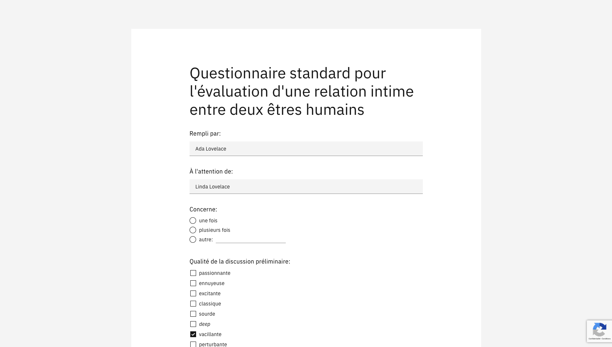

# Hiersoir.ch

[Hiersoir.ch](https://hiersoir.ch) was originally a joke from the universe of my short story [“On s'écrit”](https://salejeune.com/on-secrit). In the story, the main character asks the girl he spent the night with to fill out a satisfaction form. For fun, I decided the make this form become real.

## Technical overview

Flow:

1. The user fills out the form.
	- During this time, form data is continuously saved to local storage to avoid loosing content in case of a page reload.
2. The user saves the form on the server by clicking a button.
	1. A unique key and an initialization vector are generated.
	2. The content of the form is encrypted using the key and the IV.
	3. The encrypted content and the IV are sent to the backend for storage.
	4. The backend returns a unique ID.
	5. A URL with its fragment containing the key and the ID is shown to the user.
3. Other users can access the form content using the generated URL.
	1. On page load, if the URL fragment is not empty, the encrypted content and IV corresponding to the ID are loaded from the server.
	2. The content is decrypted thanks to the key (which never reached the server) and the IV.
	3. The decrypted content is shown to the user.
4. The user can click a button to start filling a new form.

Technologies used:

- The form UI is based on [the carbon design system](https://www.carbondesignsystem.com/) from IBM.
- The front end is coded in vanilla JavaScript, making use of modern syntax ([`async/await`](https://developer.mozilla.org/en-US/docs/Web/JavaScript/Reference/Statements/async_function), [destructuring](https://developer.mozilla.org/en-US/docs/Web/JavaScript/Reference/Operators/Destructuring_assignment), [`for..of`](https://developer.mozilla.org/en-US/docs/Web/JavaScript/Reference/Statements/for...of), etc.) and APIs ([Web Crypto API](https://developer.mozilla.org/en-US/docs/Web/API/Web_Crypto_API), [FormData](https://developer.mozilla.org/en-US/docs/Web/API/FormData), [fetch](https://developer.mozilla.org/en-US/docs/Web/API/Fetch_API/Using_Fetch), etc.).
- As I had a PHP server on hand, the backend is a simple PHP app composed of the main page (`html/index.php`) and of a light JSON API (`html/load.php` and `html/store.php`).
- Google's [reCAPTCHA v3](https://developers.google.com/recaptcha/docs/v3) is used to avoid automated storage requests.
- The content of the form is parsed from `questions.txt`.
- For easy development, a [`docker-compose`](https://docs.docker.com/compose/) file is available.
- `.htaccess` content comes from [HTML5 Boilerplate](https://html5boilerplate.com/).
